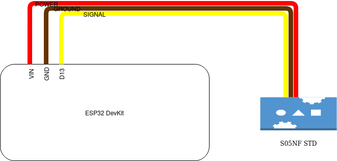

# Module for S05NF STD

**Manufacturer:**  Sparkfun

**Model:** S05NF STD

**Module type (code):**  ROB-10333

**Author:** Tomas Bellus

**Datapoints:**

| Datapoint name | Datapoint code | Units | Writable | Description |
|---|---|---|---|---|
| position angle | ANGLE | degrees| true | Sets the position angle of the servo. Value ranges: <180, 0> |

**Wiring scheme**:

